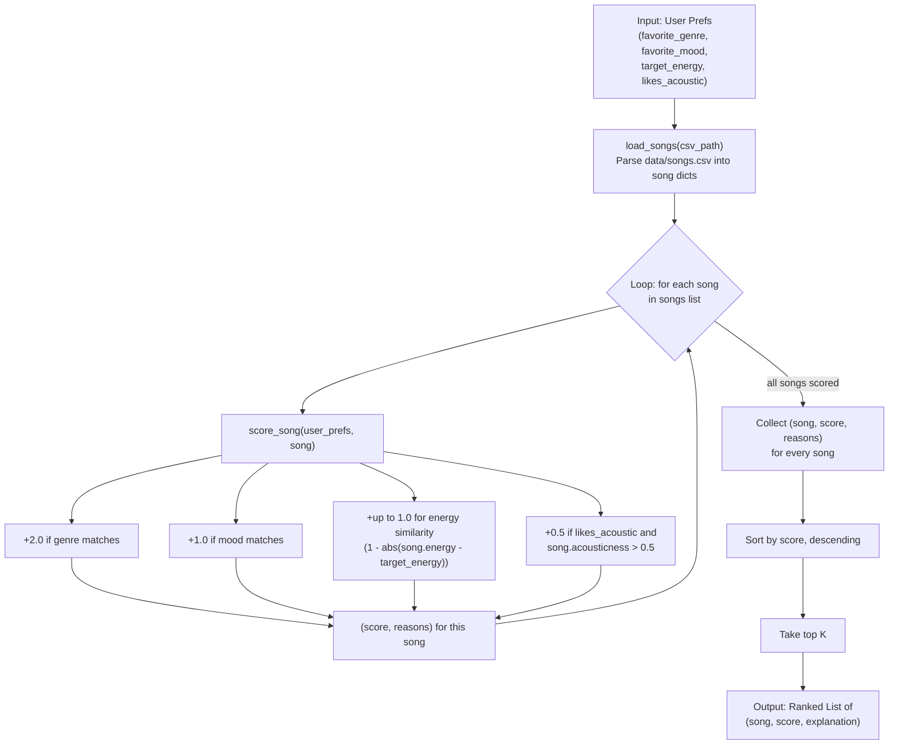

```mermaid
flowchart TD
    A["Input: User Prefs\n(favorite_genre, favorite_mood,\ntarget_energy, likes_acoustic)"] --> B["load_songs(csv_path)\nParse data/songs.csv into song dicts"]
    B --> C{"Loop: for each song\nin songs list"}
    C --> D["score_song(user_prefs, song)"]
    D --> D1["+2.0 if genre matches"]
    D --> D2["+1.0 if mood matches"]
    D --> D3["+up to 1.0 for energy similarity\n(1 - abs(song.energy - target_energy))"]
    D --> D4["+0.5 if likes_acoustic and\nsong.acousticness > 0.5"]
    D1 --> E["(score, reasons) for this song"]
    D2 --> E
    D3 --> E
    D4 --> E
    E --> C
    C -->|all songs scored| F["Collect (song, score, reasons)\nfor every song"]
    F --> G["Sort by score, descending"]
    G --> H["Take top K"]
    H --> I["Output: Ranked List of\n(song, score, explanation)"]
```
